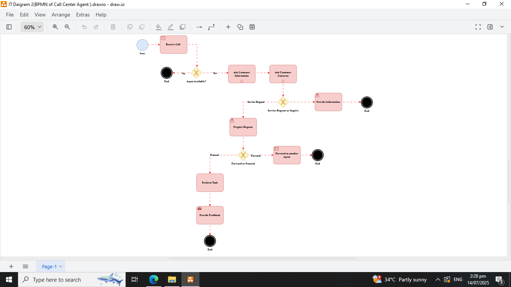

# IT-Diagramming-Call-Center-Agent

## Description
This project demonstrates a complete IT Diagram setup using:
- **1 Start**
- **8 Task**
- **3 Conditions**
- **4 End Events**

The diagram includes **Shapes**, **Legends**, **Styles**, and **Connections between shapes** . Designed and Queried using **Draw.io**, this setup is ideal for learning how to design Business Process Modeling and Notation base on specific process.

---

## Project Objectives
- Analyze Process.
- Design BPMN.
- Practice System Design.
- Simulate and Visualize the responsibility of Cal Center Agent

---

## Repository Contents

# Styles/
- **Entity.txt**
- **Data Store.txt**
- **Data Process.txt**
- **Data Arrow.txt**

# Overview 

# IT Diagram Source File/
- **IT Diagrams 2 (BPMN of Call Center Agent).drawio**
  
# README.md

## Tools Used
- **Draw.io** – for System Design
- **Text Editor** – for writing and reviewing Shape Styles 

---

## How to Use
1. Open the `IT Diagrams 2 (BPMN of Call Center Agent).drawio` file using **Draw.io**.
2. Check the Shapes if properly connected.
3. try to move shape's and edit the text and appearance of the shapes.

---

## Author
**[ITArchitect111](https://github.com/ITArchitect111)**  
BS in Information Systems – Isabela, Philippines  
**TikTok**: [@it_ako123](https://www.tiktok.com/@it_ako123)

---

## License
This project is provided for educational purposes only.  
Feel free to fork or adapt it with proper credit.
